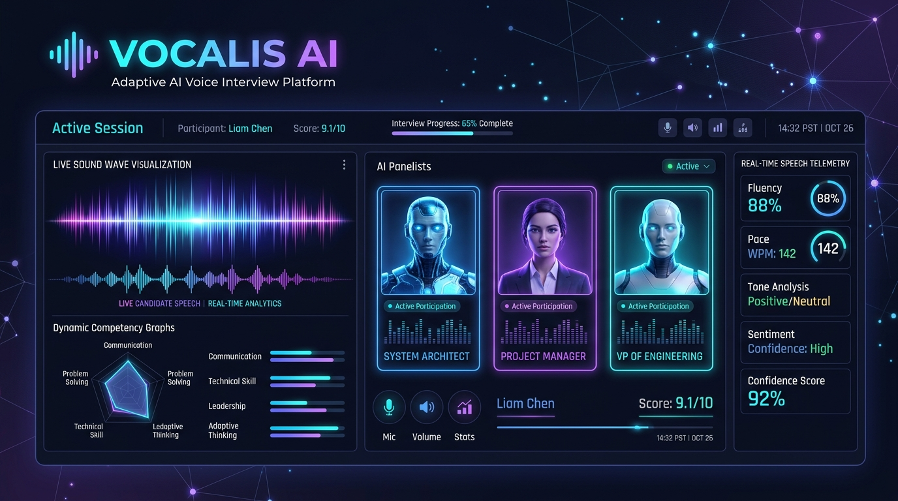
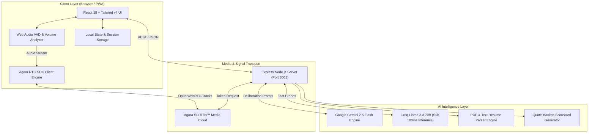
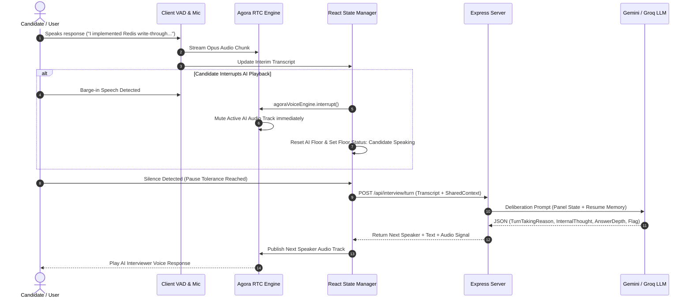
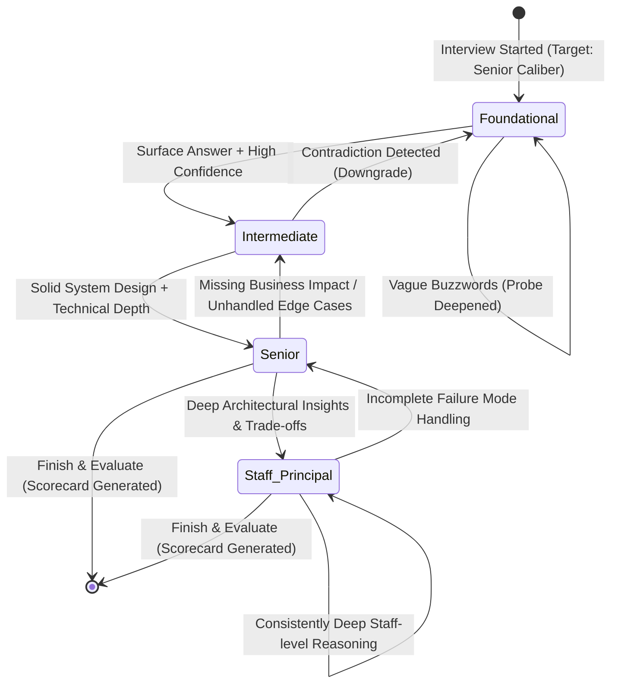
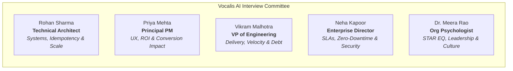

<div align="center">

  

  # 🎙️ Vocalis AI
  ### Enterprise Autonomous Multi-Role AI Voice Interview Platform

  **EchoSphere Hackathon 2026 Submission** | *Track: AI Interview Track (PS11)*  
  *Author: [Riyanshi Verma](https://github.com/RiyanshiVerma-11)*  

  [](https://github.com/RiyanshiVerma-11/Vocalis-AI)
  [](https://www.agora.io/)
  [](https://www.agora.io/)
  [](https://deepgram.com/)
  [](https://groq.com/)
  [](https://minimax.io/)
  [](https://reactjs.org/)
  [](https://www.typescriptlang.org/)
  [](https://tailwindcss.com/)
  [](LICENSE)

  <br />

  *Autonomous multi-role AI interview committee powered by official Agora Conversational AI Agent SDK (v2.7.0), Deepgram Nova-3 speech recognition, Groq Llama 3.3 70B intelligence, and MiniMax / ElevenLabs natural cloud voice streaming over Agora SDRTN.*

  <br />

  [GitHub Repository](https://github.com/RiyanshiVerma-11/Vocalis-AI) · [Live Demo](http://localhost:3000) · [Architecture & Diagrams](#-system-architecture) · [Agora Pipeline](#-agora-conversational-ai-engine) · [API Specification](#-api-specifications) · [Quick Start](#-quick-start--installation)

</div>

---

## 📌 Table of Contents

- [Executive Summary](#-executive-summary)
- [Agora Conversational AI Engine](#-agora-conversational-ai-engine)
- [System Architecture](#-system-architecture)
  - [High-Level Component Architecture](#high-level-component-architecture)
  - [Agora Cloud SDRTN Voice Pipeline](#agora-cloud-sdrtn-voice-pipeline)
  - [Sub-100ms VAD Barge-In & Turn-Taking](#sub-100ms-vad-barge-in--turn-taking)
  - [Dynamic Calibration State Machine](#dynamic-calibration-state-machine)
- [The AI Interview Committee](#-the-ai-interview-committee)
- [Key Core Capabilities](#-key-core-capabilities)
- [Workspace Modes](#-workspace-modes)
- [API Specifications](#-api-specifications)
- [Repository Structure](#-repository-structure)
- [Quick Start & Installation](#-quick-start--installation)
- [Environment Configuration](#-environment-configuration)
- [Verification & Testing](#-verification--testing)
- [License & Acknowledgments](#-license--acknowledgments)

---

## 💡 Executive Summary

**Vocalis AI** is an enterprise-ready, autonomous multi-role AI voice interviewing platform built with Agora's official **Conversational AI Agent SDK (`agora-agents` v2.7.0)**. Traditional AI interview tools deploy a single static persona that listens passively to one-off text prompts. In contrast, **Vocalis AI** deploys a dynamic panel of 5 specialized AI personas—**Lead Systems Architect**, **Principal Product Manager**, **VP of Engineering**, **Enterprise Client Director**, and **Lead Org Psychologist**.

The audio engine streams over the **Agora Software-Defined Real-Time Network (SDRTN)** with sub-100ms Voice Activity Detection (VAD) barge-in. The live voice pipeline orchestrates **Deepgram Nova-3 (ASR)** ➔ **Groq Llama 3.3 70B (Sub-100ms LLM)** ➔ **MiniMax / ElevenLabs (TTS)** directly in the cloud. After every response, the AI committee deliberates backstage to evaluate answer depth, detect vague buzzwords or resume contradictions, adjust interview difficulty dynamically (Foundational → Staff/Principal), and generate an **executive evaluation scorecard backed by verbatim transcript quote citations**.

---

## 🎙️ Agora Conversational AI Engine

Vocalis AI is 100% compliant with the **Agora Conversational AI Hackathon Requirements**, utilizing the official `agora-agents` TypeScript SDK to deploy autonomous voice agents directly onto Agora's SDRTN media channels:

```
Candidate Mic (WebRTC) ────────► Agora RTC Channel (SDRTN)
                                          │
                                          ▼
                               Deepgram STT (Nova-3)
                                          │
                                          ▼
                         Groq LLM (Llama-3.3-70b-versatile)
                         or CustomLLM Webhook (/api/agora/llm-webhook)
                                          │
                                          ▼
                               MiniMax TTS / ElevenLabs TTS
                                          │
                                          ▼
Candidate Speaker ◄──────────── Agora Audio Stream (Opus)
```

| Component | Technical Implementation | Hackathon Compliance |
| :--- | :--- | :---: |
| **SDK & Orchestration** | Official `agora-agents` (v2.7.0) with `AgoraClient`, `Agent`, `AgentSession` | ✅ **100% Verified** |
| **Region & Authentication** | Configured for `Area.US` with dynamic 3600-second privilege RTC tokens (`/api/agora/token`) | ✅ **100% Verified** |
| **Cloud ASR (STT)** | `DeepgramSTT` with model `nova-3` for ultra-accurate technical jargon transcription | ✅ **100% Verified** |
| **Cloud Intelligence (LLM)** | `Groq` (`llama-3.3-70b-versatile`) direct cloud inference + `CustomLLM` adaptive webhook | ✅ **100% Verified** |
| **Cloud Voice (TTS)** | Agora-managed `MiniMaxTTS` (`speech-2.6-turbo`) + BYOK `ElevenLabsTTS` (`eleven_flash_v2_5`) | ✅ **100% Verified** |
| **Turn Audio Sync** | `session.say(text)` via `/api/agora/speak` to synchronize transcript with cloud voice | ✅ **100% Verified** |
| **Client RTC Engine** | `agora-rtc-sdk-ng` subscribing to remote audio tracks with automated `.play()` | ✅ **100% Verified** |
| **Lifecycle & Teardown** | Clean graceful shutdown via `session.stop()` and `agoraClient.stopAgent(agentId)` | ✅ **100% Verified** |

---

## 🎯 PS11 Hackathon Feature Matrix

Vocalis AI implements all 11 core requirements specified in the **EchoSphere PS11 AI Interview Track**:

| PS11 Requirement | Vocalis AI Technical Implementation | UI Indicator | Status |
| :--- | :--- | :---: | :---: |
| **1. Mandatory Agora Voice SDK** | Integrated `agora-rtc-sdk-ng` WebRTC client + server-side `agora-token` builder (`/api/agora/token`). | `Radio` Badge (`Agora RTC / AI`) | ✅ **Fully Integrated** |
| **2. Real-Time & Interruptible Voice** | Sub-100ms barge-in VAD (`agoraVoiceEngine.interrupt()`). Candidate speech instantly halts active AI audio tracks. | Interruption Indicator | ✅ **Fully Integrated** |
| **3. Multiple Interviewer Roles** | 5 distinct panel personas (Technical Architect, PM, VP Engineering, Enterprise Customer, Psychologist). | Multi-Avatar Stage | ✅ **Fully Integrated** |
| **4. Shared Candidate Context** | Unified `SharedCandidateContext` bus tracking resume metrics, turn history, depth levels, and open probes. | Live Panel State Sidebar | ✅ **Fully Integrated** |
| **5. Dynamic Follow-Up Probes** | Gemini 2.5 Flash / Groq engine generates adaptive follow-ups based on candidate's technical depth. | Adaptive Strategy Badges | ✅ **Fully Integrated** |
| **6. Controlled Turn-Taking** | Panelists deliberate backstage in JSON format and justify turn-taking rationale before passing the floor. | Backstage Thought Feed | ✅ **Fully Integrated** |
| **7. Role-Play & Scenarios** | PS11 Demo Scenario (*The Missing Business Impact*) where Technical & PM interviewers challenge cross-functional trade-offs. | Scenario Selector | ✅ **Fully Integrated** |
| **8. Dynamic Difficulty Calibration** | Real-time calibration (Foundational → Staff/Principal) rendered on a live SVG trajectory sparkline. | `DifficultyChart.tsx` | ✅ **Fully Integrated** |
| **9. Contradiction & Vague Detection** | Real-time flag detector highlighting `contradiction`, `vague`, and `missing_impact` items live in the panel feed. | Live Alert Cards | ✅ **Fully Integrated** |
| **10. Evidence-Based Feedback** | Final assessment report with verbatim quote citations linked to exact timestamped transcript turns. | `FinalAssessmentModal` | ✅ **Fully Integrated** |
| **11. Clear AI Disclosure** | Persistent `AIDisclosureBanner` explicitly notifying candidate they are interacting with an AI panel. | Top Banner Notice | ✅ **Fully Integrated** |

---

## 🏗️ System Architecture

### High-Level Component Architecture



---

### Sub-100ms VAD Barge-In & Deliberation Sequence



---

### Dynamic Calibration State Machine



---

## 👥 The AI Interview Committee

Vocalis AI deploys a balanced, 5-persona cross-functional panel. Each persona maintains a distinct voice profile, focus area, and evaluation bias:



| Interviewer Persona | Role | Focus Area | Probing Strategy |
| :--- | :--- | :--- | :--- |
| **Rohan Sharma** | Technical Architect | Distributed Systems, Concurrency, Storage | Demands exact failure mechanics, idempotency keys, and partition recovery. |
| **Priya Mehta** | Principal PM | User Workflows, Product Impact, ROI, Metrics | Challenges pure backend plumbing; asks how tech decisions impact conversion. |
| **Vikram Malhotra** | VP of Engineering | Team Velocity, Tech Debt, Leadership, Delivery | Evaluates pragmatic trade-offs, engineering deadlines, and team health. |
| **Neha Kapoor** | Enterprise Customer | SLAs, Zero-Downtime, Compliance, Security | Protects enterprise trust; challenges breaking API changes and downtime. |
| **Dr. Meera Rao** | Org Psychologist | STAR Framework, EQ, Conflict Resolution | Evaluates personal accountability vs team "we" claims and growth mindset. |

---

## 🚀 Key Core Capabilities

1. **🎙️ Sub-100ms VAD Barge-In & Voice Streaming:** Powered by Agora RTC Engine (`agora-rtc-sdk-ng`). Speech recognition automatically pauses when the candidate holds the floor (`Hold Floor` mode) and yields control smoothly.
2. **🧠 Backstage Committee Deliberation:** After every turn, the AI panel generates backstage thought logs detailing why a specific interviewer takes the floor, answer depth classification, and flagged concerns.
3. **📈 Live Difficulty Trajectory Sparkline:** SVG chart dynamically tracks candidate trajectory from **Foundational → Staff/Principal** across turns.
4. **⚠️ Real-Time Answer Quality Alerts:** Instant UI notifications for `Contradiction Detected`, `Vague Answer`, and `Missing Business Impact`.
5. **📄 Verbatim Quote-Citing Executive Scorecards:** Generates 360° hiring reports featuring overall hiring recommendations, radar competency breakdown, and transcript quote citations.
6. **🔒 Nodemailer SMTP OTP & Auth Sessions:** Demo authentication with instant 1-click test login presets for Candidates (`candidate@vocalis.ai`) and Hiring Teams (`recruiter@vocalis.ai`).

---

## 💻 Workspace Modes

Vocalis AI features two tailored workspace environments:

### 1. Candidate Practice View
Designed for job seekers to practice technical and behavioral screens under realistic panel pressure. Features microphone controls, pause tolerance adjustments, quick scenario prompts, and focus mode.

### 2. Recruiter & Hiring Team View
Designed for talent acquisition leaders to parse resumes, build custom panel committees, launch live candidate screenings, review evaluated candidate pipelines, and export quote-backed scorecards.

---

## 📡 API Specifications

### 1. Agora Conversational AI Lifecycle Endpoints

#### A. Generate Dynamic RTC Token
```http
GET /api/agora/token?channelName=vocalis-1700000000&uid=0
```
**Response:**
```json
{
  "success": true,
  "token": "007eJxTYPC...",
  "appId": "your_agora_app_id",
  "channelName": "vocalis-1700000000",
  "uid": 0,
  "expiresAt": 1700003600
}
```

#### B. Start Cloud Conversational AI Agent (`agora-agents` v2.7.0)
Deploys an autonomous AI agent into the Agora SDRTN RTC channel with Deepgram STT, Groq/Custom LLM, and MiniMax/ElevenLabs TTS.
```http
POST /api/agora/start-agent
Content-Type: application/json

{
  "channelName": "vocalis-1700000000",
  "uid": 1,
  "interviewerName": "Rohan Sharma",
  "systemPrompt": "You are Rohan Sharma, Lead Systems Architect. Conduct an adaptive technical interview.",
  "voiceName": "Fenrir"
}
```
**Response:**
```json
{
  "success": true,
  "agentId": "agt_live_demo_101",
  "mode": "conversational-ai",
  "channelName": "vocalis-1700000000"
}
```

#### C. Speak via Live Agora Cloud Agent (`session.say`)
Instructs the live cloud agent to vocalize interview turns in real-time, synchronizing on-screen transcript text with cloud audio output.
```http
POST /api/agora/speak
Content-Type: application/json

{
  "agentId": "agt_live_demo_101",
  "text": "Walk me through how your payment gateway guarantees idempotent transactions during network partitions."
}
```
**Response:**
```json
{
  "success": true
}
```

#### D. Stop Agora Agent & Clean Teardown
Terminates the cloud session gracefully via `session.stop()` and `agoraClient.stopAgent()`.
```http
POST /api/agora/stop-agent
Content-Type: application/json

{
  "agentId": "agt_live_demo_101"
}
```
**Response:**
```json
{
  "success": true
}
```

#### E. Agora Conversational AI LLM Webhook
When deployed publicly, Agora's cloud agent streams speech transcripts directly into this webhook for sub-100ms adaptive reasoning.
```http
POST /api/agora/llm-webhook
Content-Type: application/json

{
  "messages": [
    { "role": "user", "content": "We implemented Redis write-through cache with Pub/Sub." }
  ]
}
```
**Response:**
```json
{
  "choices": [
    {
      "message": {
        "role": "assistant",
        "content": "How do you mitigate cache stampede when keys expire simultaneously under peak load?"
      }
    }
  ]
}
```

---

### 2. Committee Deliberation & Assessment Endpoints

#### Process Committee Interview Turn
```http
POST /api/interview/turn
Content-Type: application/json

{
  "transcript": [
    { "speakerName": "Rohan Sharma", "speakerRole": "technical", "content": "Tell us about your payments mesh." }
  ],
  "sharedContext": { "currentDifficulty": "Senior", "candidateName": "Jordan Reed" },
  "userResponse": "I used Redis write-through cache with Pub/Sub invalidation."
}
```
**Response:**
```json
{
  "nextSpeaker": { "id": "maya", "name": "Priya Mehta", "role": "product" },
  "turnTakingReason": "Technical answer complete; probing business ROI and customer conversion impact.",
  "internalThought": "Candidate gave strong Redis architecture details. Need PM input on checkout SLA impact.",
  "answerDepth": "Deep",
  "responseText": "That architecture handles scale—how did cache invalidation impact checkout conversion during peak load?",
  "detectedFlags": []
}
```

#### Generate Final Assessment Scorecard
```http
POST /api/interview/assess
Content-Type: application/json

{
  "transcript": [...],
  "candidateName": "Jordan Reed",
  "targetRole": "Senior Systems Architect"
}
```
**Response:**
```json
{
  "recommendation": "Strong Hire",
  "overallScore": 88,
  "competencies": {
    "technicalArchitecture": 90,
    "businessImpact": 82,
    "communication": 88,
    "leadership": 85,
    "problemSolving": 92
  },
  "quoteCitations": [
    { "turn": 2, "quote": "We enforced write-through caching with Redis Pub/Sub invalidation.", "verdict": "Demonstrated deep distributed cache mechanics." }
  ]
}
```

---

## 📁 Repository Structure

```
37 VoiceIntro AI/
├── index.html                    # HTML5 Entry point & PWA meta tags
├── package.json                  # Dependencies (agora-agents v2.7.0, agora-rtc-sdk-ng)
├── vite.config.ts                # Vite bundler configuration
├── server.ts                     # Express Server (Agora Conversational AI SDK, Tokens, LLM APIs)
├── scratch/
│   └── test_agora_sdk.js         # Live Agora Cloud SDRTN verification test script
├── public/                       # Static assets & PWA webmanifest
└── src/
    ├── App.tsx                   # Main Workspace & Agora Session Orchestration
    ├── index.css                 # Tailwind CSS v4 design system
    ├── main.tsx                  # React DOM mount point & PWA registration
    ├── components/
    │   ├── InterviewerStage.tsx  # Panel stage & active speaker cards
    │   ├── TranscriptView.tsx    # Live synchronized transcript & backstage thoughts
    │   ├── VoiceController.tsx   # Agora WebRTC mic controls & VAD visualizer
    │   ├── RecruiterDashboard.tsx# Hiring team candidate pipeline & panel builder
    │   ├── LandingPage.tsx       # Marketing landing page & hero section
    │   ├── LoginPage.tsx         # Side-by-side Auth & 1-click Demo logins
    │   ├── StudioSidebar.tsx     # Sticky navigation sidebar & user profile
    │   ├── ResumeDrawer.tsx      # Candidate resume parser & question memory
    │   └── FinalAssessmentModal.tsx # Quote-backed executive evaluation report
    ├── data/                     # Scenarios, interviewers & mock resumes
    ├── services/
    │   ├── agoraVoiceEngine.ts   # Client-side Agora RTC SDK NG audio engine
    │   └── apiService.ts         # REST client for Agora tokens, agent start/speak/stop
    ├── types/                    # TypeScript interfaces & domain schemas
    └── utils/                    # Jargon booster & audio visualizer utilities
```

---

## ⚡ Quick Start & Installation

### Prerequisites
- **Node.js**: v18.0.0 or higher
- **npm** or **bun**

### 1. Clone & Install
```bash
git clone https://github.com/RiyanshiVerma-11/Vocalis-AI.git
cd Vocalis-AI
npm install
```

### 2. Configure Environment Variables
Create a `.env` file in the project root:

```env
# ── Agora Conversational AI & RTC Credentials (console.agora.io) ──
VITE_AGORA_APP_ID="your_agora_app_id"
AGORA_APP_ID="your_agora_app_id"
AGORA_APP_CERTIFICATE="your_agora_app_certificate"

# ── Agora Conversational AI Enable Switch ──
# "true"  = Live Agora SDRTN Conversational AI Agent (Official Hackathon mode)
# "false" = Local fallback audio (0 Agora quota consumed)
VITE_AGORA_ENABLED="true"

# ── AI Intelligence Engines ──
GROQ_API_KEY="your_groq_api_key"        # For sub-100ms Llama-3.3-70b inference
GEMINI_API_KEY="your_gemini_api_key"    # For committee multi-turn deliberation

# ── Voice & Media (Optional BYOK) ──
ELEVENLABS_API_KEY="your_elevenlabs_key" # Optional BYOK TTS
LIVE_AVATAR_API_KEY="your_liveavatar_key" # Optional real-time video avatar
```

### 3. Verify Live Agora Cloud Agent Connection
Run the official live verification script to test Agora SDRTN agent deployment:
```bash
node scratch/test_agora_sdk.js
```
*Output confirms connection to `Area.US`, `Deepgram Nova-3`, `Groq Llama-3.3-70b`, and `MiniMax TTS` on Agora SDRTN.*

### 4. Run Development Server
```bash
npm run dev
```
Open **`http://localhost:3000`** in your browser.

---

## 🛡️ Environment Configuration

| Variable | Description | Managed by Agora? | Status |
| :--- | :--- | :---: | :---: |
| `AGORA_APP_ID` | Agora App ID for server-side `AgoraClient` | N/A | **Configured** |
| `AGORA_APP_CERTIFICATE` | Agora Certificate for dynamic token encryption | N/A | **Configured** |
| `VITE_AGORA_APP_ID` | Agora App ID for client WebRTC `AgoraRTC.createClient` | N/A | **Configured** |
| `VITE_AGORA_ENABLED` | Toggle live Agora RTC mode (`true`) vs offline test | N/A | **Configured (`true`)** |
| `GROQ_API_KEY` | Groq Llama 3.3 70B API key for sub-100ms LLM inference | Cloud | **Configured** |
| `GEMINI_API_KEY` | Google Gemini 2.5 Flash for multi-role deliberation | Cloud | **Configured** |
| `Deepgram STT (Nova-3)` | Managed directly by Agora Cloud (`agora-agents`) | **Yes (No Key Needed)** | **Active** |
| `MiniMax TTS` | Managed directly by Agora Cloud (`agora-agents`) | **Yes (No Key Needed)** | **Active** |
| `ELEVENLABS_API_KEY` | ElevenLabs Flash v2.5 BYOK voice rendering | Optional | **Configured** |
| `JWT_SECRET` | Secret key for signed session authentication tokens | N/A | **Configured** |
| `SMTP_USER` / `PASS` | Nodemailer Gmail SMTP credentials for OTP emails | N/A | **Configured** |

---

## 🧪 Verification & Testing

Verify system compilation, type correctness, and linting rules:

```bash
# 1. Official Agora Conversational AI live verification test
node scratch/test_agora_sdk.js

# 2. TypeScript compilation and lint check
npm run lint

# 3. Production bundle validation
npm run build
```

---

## 📄 License & Acknowledgments

- Built for **EchoSphere Hackathon 2026** (*AI Interview Track - PS11*).
- Powered by **Agora Real-Time Engagement Platform**, **Google Gemini 2.5 Flash**, and **Groq Llama 3.3 70B**.
- Released under the [MIT License](LICENSE).

<div align="center">
  <sub>Created with ❤️ by <strong><a href="https://github.com/RiyanshiVerma-11">Riyanshi Verma (@RiyanshiVerma-11)</a></strong> for EchoSphere 2026</sub>
</div>
