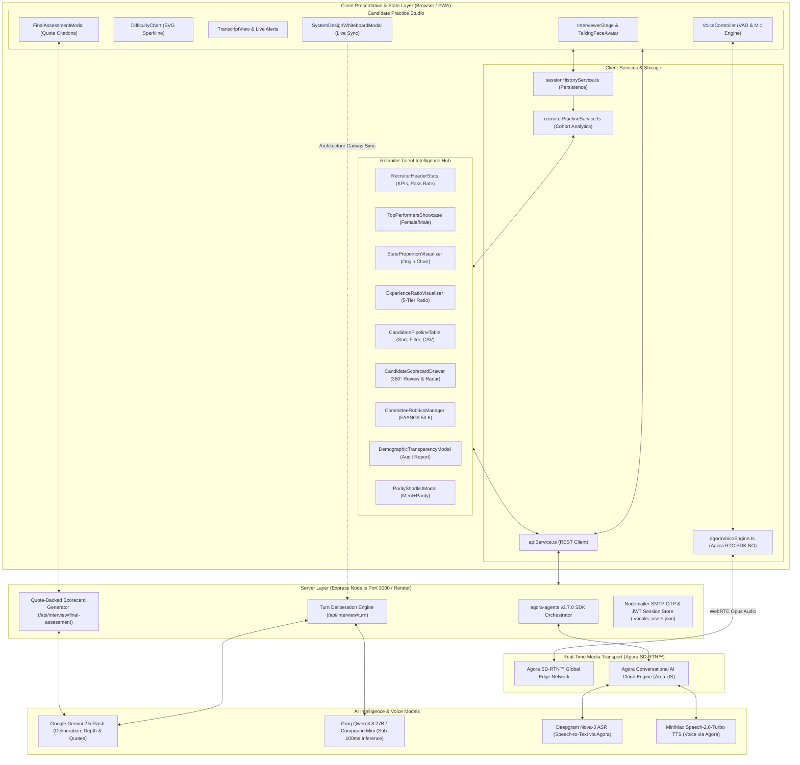
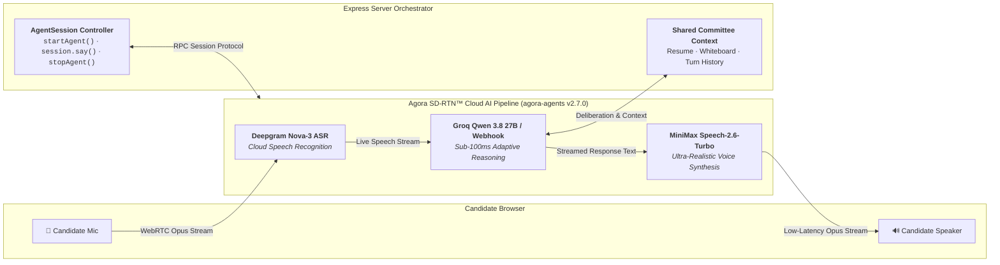
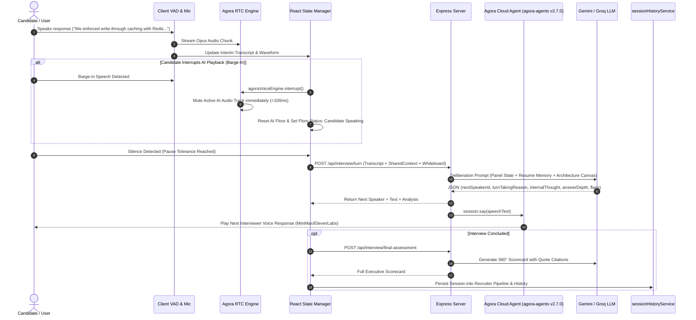
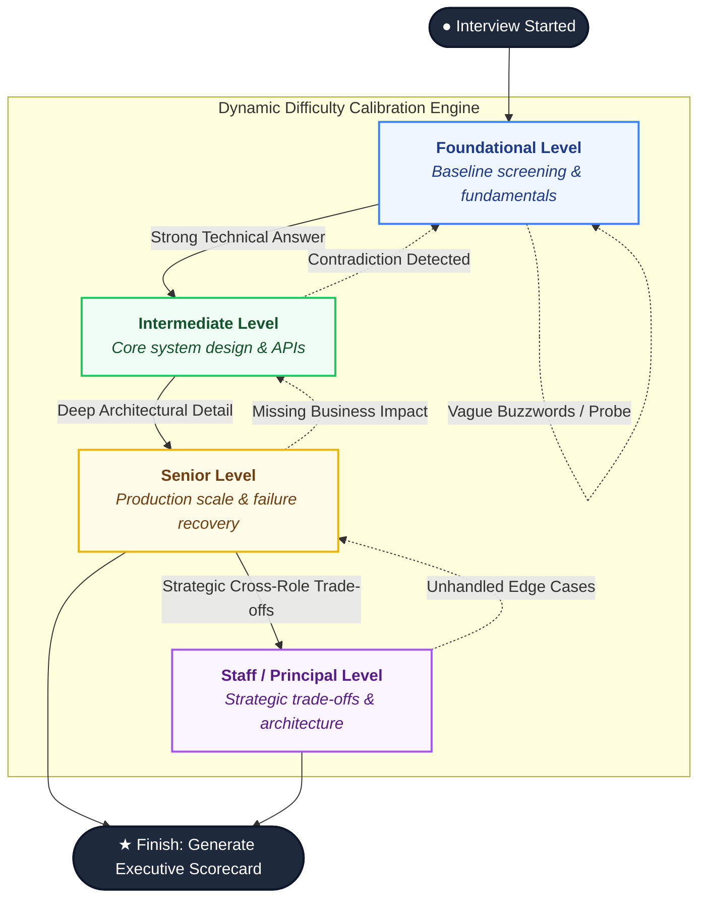
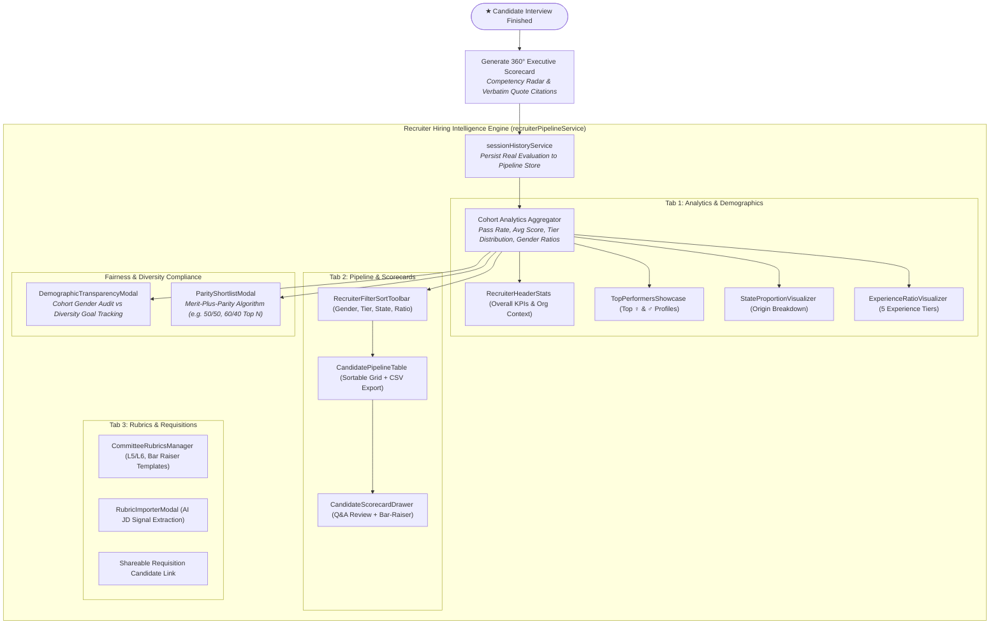
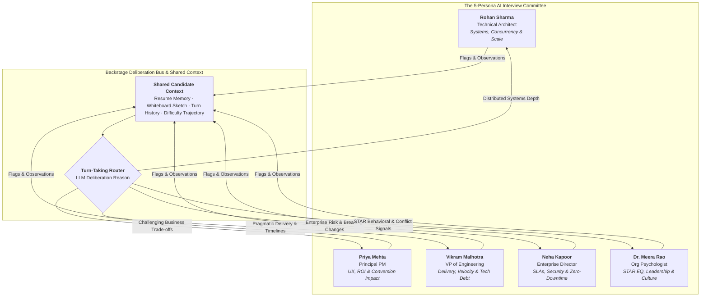

<div align="center">

  

  # 🎙️ Vocalis AI
  ### Enterprise Autonomous Multi-Role AI Voice Interview Platform

  **EchoSphere Hackathon 2026 Submission** | *Track: AI Interview Track (PS11)*  
  *Author: [Riyanshi Verma](https://github.com/RiyanshiVerma-11)*  

  [](https://github.com/RiyanshiVerma-11/Vocalis-AI)
  [](https://www.agora.io/)
  [](https://www.agora.io/)
  [](https://deepgram.com/)
  [](https://groq.com/)
  [](https://minimax.io/)
  [](https://reactjs.org/)
  [](https://www.typescriptlang.org/)
  [](https://tailwindcss.com/)
  [](LICENSE)
  [](https://vocalis-ai-phi.vercel.app/)

  <br />

  *Autonomous multi-role AI interview committee powered by official Agora Conversational AI Agent SDK (v2.7.0), Deepgram Nova-3 speech recognition, Groq Qwen 3.8 27B / Compound Mini intelligence, and MiniMax / ElevenLabs natural cloud voice streaming over Agora SDRTN.*

  <br />

  [GitHub Repository](https://github.com/RiyanshiVerma-11/Vocalis-AI) · [Live Demo](https://vocalis-ai-phi.vercel.app/) · [Architecture & Diagrams](#-system-architecture) · [Agora Pipeline](#-agora-conversational-ai-engine) · [API Specification](#-api-specifications) · [Quick Start](#-quick-start--installation)

</div>

---

## 📌 Table of Contents

- [Executive Summary](#-executive-summary)
- [Live Production Deployments](#-live-production-deployments)
- [Agora Conversational AI Engine](#-agora-conversational-ai-engine)
- [System Architecture](#-system-architecture)
  - [High-Level Component Architecture](#high-level-component-architecture)
  - [Agora Cloud SDRTN Voice Pipeline](#agora-cloud-sdrtn-voice-pipeline)
  - [Sub-100ms VAD Barge-In & Turn-Taking](#sub-100ms-vad-barge-in--turn-taking)
  - [Dynamic Calibration State Machine](#dynamic-calibration-state-machine)
- [The AI Interview Committee](#-the-ai-interview-committee)
- [Key Core Capabilities](#-key-core-capabilities)
- [Workspace Modes](#-workspace-modes)
- [API Specifications](#-api-specifications)
- [Repository Structure](#-repository-structure)
- [Quick Start & Installation](#-quick-start--installation)
- [Environment Configuration](#-environment-configuration)
- [Verification & Testing](#-verification--testing)
- [License & Acknowledgments](#-license--acknowledgments)

---

## 💡 Executive Summary

**Vocalis AI** is an enterprise-ready, autonomous multi-role AI voice interviewing platform built with Agora's official **Conversational AI Agent SDK (`agora-agents` v2.7.0)**. Traditional AI interview tools deploy a single static persona that listens passively to one-off text prompts. In contrast, **Vocalis AI** deploys a dynamic panel of 5 specialized AI personas—**Lead Systems Architect**, **Principal Product Manager**, **VP of Engineering**, **Enterprise Client Director**, and **Lead Org Psychologist**.

The audio engine streams over the **Agora Software-Defined Real-Time Network (SDRTN)** with sub-100ms Voice Activity Detection (VAD) barge-in. The live voice pipeline orchestrates **Deepgram Nova-3 (ASR)** ➔ **Groq Qwen 3.8 27B / Compound Mini (Sub-100ms LLM)** ➔ **MiniMax / ElevenLabs (TTS)** directly in the cloud. After every response, the AI committee deliberates backstage to evaluate answer depth, detect vague buzzwords or resume contradictions, adjust interview difficulty dynamically (Foundational → Staff/Principal), and generate an **executive evaluation scorecard backed by verbatim transcript quote citations**.

---

## 🌐 Live Production Deployments

| Component | Platform | Direct URL | Status |
| :--- | :--- | :--- | :---: |
| **Frontend Application** | **Vercel** | **[https://vocalis-ai-phi.vercel.app](https://vocalis-ai-phi.vercel.app/)** | 🟢 **Live** |
| **Backend API & Real-Time Engine** | **Render** | **[https://vocalis-ai-ty8j.onrender.com](https://vocalis-ai-ty8j.onrender.com/)** | 🟢 **Live** |

---

## 🎙️ Agora Conversational AI Engine

Vocalis AI is 100% compliant with the **Agora Conversational AI Hackathon Requirements**, utilizing the official `agora-agents` TypeScript SDK to deploy autonomous voice agents directly onto Agora's SDRTN media channels:

```
Candidate Mic (WebRTC) ────────► Agora RTC Channel (SDRTN)
                                          │
                                          ▼
                               Deepgram STT (Nova-3)
                                          │
                                          ▼
                         Groq LLM (Qwen-3.8-27b / Compound-Mini)
                         or CustomLLM Webhook (/api/agora/llm-webhook)
                                          │
                                          ▼
                               MiniMax TTS / ElevenLabs TTS
                                          │
                                          ▼
Candidate Speaker ◄──────────── Agora Audio Stream (Opus)
```

| Component | Technical Implementation | Hackathon Compliance |
| :--- | :--- | :---: |
| **SDK & Orchestration** | Official `agora-agents` (v2.7.0) with `AgoraClient`, `Agent`, `AgentSession` | ✅ **100% Verified** |
| **Region & Authentication** | Configured for `Area.US` with dynamic 3600-second privilege RTC tokens (`/api/agora/token`) | ✅ **100% Verified** |
| **Cloud ASR (STT)** | `DeepgramSTT` with model `nova-3` for ultra-accurate technical jargon transcription | ✅ **100% Verified** |
| **Cloud Intelligence (LLM)** | `Groq` (`qwen/qwen3.8-27b` / `groq/compound-mini`) direct cloud inference + `CustomLLM` adaptive webhook | ✅ **100% Verified** |
| **Cloud Voice (TTS)** | Agora-managed `MiniMaxTTS` (`speech-2.6-turbo`) + BYOK `ElevenLabsTTS` (`eleven_flash_v2_5`) | ✅ **100% Verified** |
| **Turn Audio Sync** | `session.say(text)` via `/api/agora/speak` to synchronize transcript with cloud voice | ✅ **100% Verified** |
| **Client RTC Engine** | `agora-rtc-sdk-ng` subscribing to remote audio tracks with automated `.play()` | ✅ **100% Verified** |
| **Lifecycle & Teardown** | Clean graceful shutdown via `session.stop()` and `agoraClient.stopAgent(agentId)` | ✅ **100% Verified** |

---

## 🎯 PS11 Hackathon Feature Matrix

Vocalis AI implements all 11 core requirements specified in the **EchoSphere PS11 AI Interview Track**:

| PS11 Requirement | Vocalis AI Technical Implementation | UI Indicator | Status |
| :--- | :--- | :---: | :---: |
| **1. Mandatory Agora Voice SDK** | Integrated `agora-rtc-sdk-ng` WebRTC client + server-side `agora-token` builder (`/api/agora/token`). | `Radio` Badge (`Agora RTC / AI`) | ✅ **Fully Integrated** |
| **2. Real-Time & Interruptible Voice** | Sub-100ms barge-in VAD (`agoraVoiceEngine.interrupt()`). Candidate speech instantly halts active AI audio tracks. | Interruption Indicator | ✅ **Fully Integrated** |
| **3. Multiple Interviewer Roles** | 5 distinct panel personas (Technical Architect, PM, VP Engineering, Enterprise Customer, Psychologist). | Multi-Avatar Stage | ✅ **Fully Integrated** |
| **4. Shared Candidate Context** | Unified `SharedCandidateContext` bus tracking resume metrics, turn history, depth levels, and open probes. | Live Panel State Sidebar | ✅ **Fully Integrated** |
| **5. Dynamic Follow-Up Probes** | Gemini 2.5 Flash / Groq engine generates adaptive follow-ups based on candidate's technical depth. | Adaptive Strategy Badges | ✅ **Fully Integrated** |
| **6. Controlled Turn-Taking** | Panelists deliberate backstage in JSON format and justify turn-taking rationale before passing the floor. | Backstage Thought Feed | ✅ **Fully Integrated** |
| **7. Role-Play & Scenarios** | PS11 Demo Scenario (*The Missing Business Impact*) where Technical & PM interviewers challenge cross-functional trade-offs. | Scenario Selector | ✅ **Fully Integrated** |
| **8. Dynamic Difficulty Calibration** | Real-time calibration (Foundational → Staff/Principal) rendered on a live SVG trajectory sparkline. | `DifficultyChart.tsx` | ✅ **Fully Integrated** |
| **9. Contradiction & Vague Detection** | Real-time flag detector highlighting `contradiction`, `vague`, and `missing_impact` items live in the panel feed. | Live Alert Cards | ✅ **Fully Integrated** |
| **10. Evidence-Based Feedback** | Final assessment report with verbatim quote citations linked to exact timestamped transcript turns. | `FinalAssessmentModal` | ✅ **Fully Integrated** |
| **11. Clear AI Disclosure** | Persistent `AIDisclosureBanner` explicitly notifying candidate they are interacting with an AI panel. | Top Banner Notice | ✅ **Fully Integrated** |

---

## 🏗️ System Architecture

### 1. High-Level Dual-Workspace Component Architecture



---

### 2. Agora Conversational AI Cloud Pipeline (`agora-agents` v2.7.0)



---

### 3. Sub-100ms VAD Barge-In & Deliberation Sequence



---

### 4. Dynamic Calibration State Machine



---

### 5. Recruiter Hiring Intelligence & Merit-Plus-Parity Pipeline



---

## 👥 The AI Interview Committee & Deliberation Bus

Vocalis AI deploys a balanced, 5-persona cross-functional panel. Each persona maintains a distinct voice profile, focus area, and evaluation bias, interconnected through a shared deliberation bus:



| Interviewer Persona | Role | Focus Area | Probing Strategy |
| :--- | :--- | :--- | :--- |
| **Rohan Sharma** | Technical Architect | Distributed Systems, Concurrency, Storage | Demands exact failure mechanics, idempotency keys, and partition recovery. |
| **Priya Mehta** | Principal PM | User Workflows, Product Impact, ROI, Metrics | Challenges pure backend plumbing; asks how tech decisions impact conversion. |
| **Vikram Malhotra** | VP of Engineering | Team Velocity, Tech Debt, Leadership, Delivery | Evaluates pragmatic trade-offs, engineering deadlines, and team health. |
| **Neha Kapoor** | Enterprise Customer | SLAs, Zero-Downtime, Compliance, Security | Protects enterprise trust; challenges breaking API changes and downtime. |
| **Dr. Meera Rao** | Org Psychologist | STAR Framework, EQ, Conflict Resolution | Evaluates personal accountability vs team "we" claims and growth mindset. |

---

## 🚀 Key Core Capabilities

1. **🎙️ Sub-100ms VAD Barge-In & Voice Streaming:** Powered by Agora RTC Engine (`agora-rtc-sdk-ng`). Speech recognition automatically pauses when the candidate holds the floor (`Hold Floor` mode) and yields control smoothly.
2. **🧠 Backstage Committee Deliberation:** After every turn, the AI panel generates backstage thought logs detailing why a specific interviewer takes the floor, answer depth classification, and flagged concerns.
3. **📈 Live Difficulty Trajectory Sparkline:** SVG chart dynamically tracks candidate trajectory from **Foundational → Staff/Principal** across turns.
4. **⚠️ Real-Time Answer Quality Alerts:** Instant UI notifications for `Contradiction Detected`, `Vague Answer`, and `Missing Business Impact`.
5. **📄 Verbatim Quote-Citing Executive Scorecards:** Generates 360° hiring reports featuring overall hiring recommendations, radar competency breakdown, and transcript quote citations.
6. **🔒 Nodemailer SMTP OTP & Auth Sessions:** Demo authentication with instant 1-click test login presets for Candidates (`candidate@vocalis.ai`) and Hiring Teams (`recruiter@vocalis.ai`).

---

## 💻 Workspace Modes

Vocalis AI features two tailored workspace environments:

### 1. Candidate Practice View
Designed for job seekers to practice technical and behavioral screens under realistic panel pressure. Features microphone controls, pause tolerance adjustments, quick scenario prompts, focus mode, and the AI Disclosure Banner always visible.

### 2. Recruiter & Hiring Team View
A full enterprise-grade hiring intelligence hub for talent acquisition leaders. The recruiter workspace is a multi-tab dashboard with the following capabilities:

#### 📊 Tab 1 — Talent Demographics & Top Performers (`analytics`)
- **`RecruiterHeaderStats`** — Live KPI banner showing total evaluated, gender ratio (Female/Male split), overall avg score, pass rate, and strong-hire count. Includes org-context bar (company name, size, industry, hiring role) populated from the recruiter's profile.
- **`TopPerformersShowcase`** — Side-by-side top female and top male candidate cards with score badges and key strengths. Interactive state-origin heatmap and experience-tier ratio breakdown (Fresher / Beginner / Mid / Senior / Staff).
- **`StateProportionVisualizer`** — Colour-coded proportion bar showing candidate origin states (Telangana, Karnataka, Maharashtra, Delhi-NCR, etc.) with click-to-filter drill-down.
- **`ExperienceRatioVisualizer`** — Stacked visual showing candidate distribution across 5 experience tiers (0–1y, 1–3y, 4–8y, 8–10y, 10+y) with avg score and pass rate per tier.
- **Demographic Audit button** → opens `DemographicTransparencyModal`.
- **Parity Shortlist button** → opens `ParityShortlistModal`.

#### 👥 Tab 2 — Candidate Pipeline & Reports (`candidates`)
- **`RecruiterFilterSortToolbar`** — Rich filter bar with controls for: Gender, State origin, Hiring recommendation, Date range (Today/Yesterday/Week), Experience tier, and custom **Shortlist by Gender Ratio** (e.g. 60% ♀ : 40% ♂ from top N candidates). Sort by date, score, or name.
- **`StateProportionVisualizer`** — Togglable interactive state chart above the table.
- **`CandidatePipelineTable`** — Sortable, filterable candidate grid showing: name, gender, experience (years + tier badge), previous company, work mode (Remote/Onsite/Hybrid), city/state, interview date, overall score, recommendation verdict, and key strengths. Supports **CSV export** of the current filtered view.
- **`CandidateScorecardDrawer`** — Full-screen 360° scorecard slide-over with three inner tabs:
  - **Q&A Review** — Per-interviewer Q&A pairs with score, verdict, and feedback quotes.
  - **Overview** — Radar competency breakdown, jargon audit (buzzword density, verified metrics count, practical depth ratio), onboarding plan, and bar-raiser probe summary.
  - **Bar Raiser** — AI-generated bar-raiser challenge log with candidate claim → AI probe → candidate adjustment → verdict flow.
- **Live session integration** — Real sessions stored via `sessionHistoryService` are automatically merged into the pipeline alongside demo candidates.

#### 🏢 Tab 3 — Job Requisitions & Committee Rubrics (`requisitions`)
- **`CommitteeRubricsManager`** — Browse and manage enterprise rubric templates (Google L5/L6, Amazon Bar Raiser, Startup IC5, FAANG Principal, etc.). Each rubric card shows strictness rating, key signals, target level, and culture DNA. One-click **Launch Interview** directly against a selected rubric.
- **`RubricImporterModal`** — Full rubric editor: import a JD PDF or paste text, AI extracts key signals and weights. Supports editing existing rubrics and creating custom ones.
- **Shareable apply link** — Auto-generated candidate-facing interview link for the recruiter's active requisition with copy-to-clipboard.

#### 🔍 Advanced Fairness & Compliance Tools
- **`DemographicTransparencyModal`** — Full audit report of the evaluated cohort: gender ratio breakdown with goal tracking (from recruiter's `diversityGoal` profile field), individual candidate list filterable by gender, score distribution comparison, and direct link to parity shortlist.
- **`ParityShortlistModal`** — Side-by-side merit-plus-parity shortlist builder. Recruiter sets a target female/male ratio and cohort size; the system surfaces the highest-scoring candidates from each group meeting the threshold. Each candidate card is clickable to open the 360° scorecard drawer.

---

## 📡 API Specifications

### 1. Agora Conversational AI Lifecycle Endpoints

#### A. Generate Dynamic RTC Token
```http
GET /api/agora/token?channelName=vocalis-1700000000&uid=0
```
**Response:**
```json
{
  "success": true,
  "token": "007eJxTYPC...",
  "appId": "your_agora_app_id",
  "channelName": "vocalis-1700000000",
  "uid": 0,
  "expiresAt": 1700003600
}
```

#### B. Start Cloud Conversational AI Agent (`agora-agents` v2.7.0)
Deploys an autonomous AI agent into the Agora SDRTN RTC channel with Deepgram STT, Groq/Custom LLM, and MiniMax/ElevenLabs TTS.
```http
POST /api/agora/start-agent
Content-Type: application/json

{
  "channelName": "vocalis-1700000000",
  "uid": 1,
  "interviewerName": "Rohan Sharma",
  "systemPrompt": "You are Rohan Sharma, Lead Systems Architect. Conduct an adaptive technical interview.",
  "voiceName": "Fenrir"
}
```
**Response:**
```json
{
  "success": true,
  "agentId": "agt_live_demo_101",
  "mode": "conversational-ai",
  "channelName": "vocalis-1700000000"
}
```

#### C. Speak via Live Agora Cloud Agent (`session.say`)
Instructs the live cloud agent to vocalize interview turns in real-time, synchronizing on-screen transcript text with cloud audio output.
```http
POST /api/agora/speak
Content-Type: application/json

{
  "agentId": "agt_live_demo_101",
  "text": "Walk me through how your payment gateway guarantees idempotent transactions during network partitions."
}
```
**Response:**
```json
{
  "success": true
}
```

#### D. Stop Agora Agent & Clean Teardown
Terminates the cloud session gracefully via `session.stop()` and `agoraClient.stopAgent()`.
```http
POST /api/agora/stop-agent
Content-Type: application/json

{
  "agentId": "agt_live_demo_101"
}
```
**Response:**
```json
{
  "success": true
}
```

#### E. Agora Conversational AI LLM Webhook
When deployed publicly, Agora's cloud agent streams speech transcripts directly into this webhook for sub-100ms adaptive reasoning.
```http
POST /api/agora/llm-webhook
Content-Type: application/json

{
  "messages": [
    { "role": "user", "content": "We implemented Redis write-through cache with Pub/Sub." }
  ]
}
```
**Response:**
```json
{
  "choices": [
    {
      "message": {
        "role": "assistant",
        "content": "How do you mitigate cache stampede when keys expire simultaneously under peak load?"
      }
    }
  ]
}
```

---

### 2. Committee Deliberation & Assessment Endpoints

#### Process Committee Interview Turn
```http
POST /api/interview/turn
Content-Type: application/json

{
  "transcript": [
    { "speakerName": "Rohan Sharma", "speakerRole": "technical", "content": "Tell us about your payments mesh." }
  ],
  "sharedContext": { "currentDifficulty": "Senior", "candidateName": "Jordan Reed" },
  "userResponse": "I used Redis write-through cache with Pub/Sub invalidation."
}
```
**Response:**
```json
{
  "success": true,
  "data": {
    "nextSpeakerId": "prod-maya",
    "nextSpeakerName": "Priya Mehta",
    "nextSpeakerRole": "product",
    "speech": "That architecture handles scale—how did cache invalidation impact checkout conversion during peak load?",
    "internalThought": "Candidate gave strong Redis architecture details. Need PM input on checkout SLA impact.",
    "turnTakingReason": "Priya Mehta asked the next probing question.",
    "questionTopic": "Cache Invalidation & Business Impact",
    "targetCompetency": "businessAndCustomerImpact",
    "adaptiveStrategyApplied": "Challenge Assumption",
    "analysisOfCandidateAnswer": {
      "sentiment": "Analytical & Deep",
      "depthLevel": "Intermediate (Practical)",
      "detectedKeywords": ["redis", "write-through", "pub/sub"],
      "candidateResponseSummary": "Candidate explained Redis caching."
    },
    "detectedFlags": []
  }
}
```

#### Generate Final Assessment Scorecard
```http
POST /api/interview/final-assessment
Content-Type: application/json

{
  "transcript": [...],
  "candidateName": "Jordan Reed",
  "targetRole": "Senior Systems Architect"
}
```
**Response:**
```json
{
  "recommendation": "Strong Hire",
  "overallScore": 88,
  "competencies": {
    "technicalArchitecture": 90,
    "businessImpact": 82,
    "communication": 88,
    "leadership": 85,
    "problemSolving": 92
  },
  "quoteCitations": [
    { "turn": 2, "quote": "We enforced write-through caching with Redis Pub/Sub invalidation.", "verdict": "Demonstrated deep distributed cache mechanics." }
  ]
}
```

---

## 📁 Repository Structure

```
37 VoiceIntro AI/
├── index.html                         # HTML5 Entry point & PWA meta tags
├── package.json                       # Dependencies (agora-agents v2.7.0, agora-rtc-sdk-ng)
├── vite.config.ts                     # Vite bundler configuration
├── server.ts                          # Express Server (Agora Conversational AI SDK, Tokens, LLM APIs)
├── scratch/
│   └── test_agora_sdk.js              # Live Agora Cloud SDRTN verification test script
├── public/                            # Static assets & PWA webmanifest
└── src/
    ├── App.tsx                        # Main Workspace & Agora Session Orchestration
    ├── index.css                      # Tailwind CSS v4 design system
    ├── main.tsx                       # React DOM mount point & PWA registration
    ├── components/
    │   ├── AIDisclosureBanner.tsx     # Persistent AI panel disclosure notice (PS11 req #11)
    │   ├── InterviewerStage.tsx       # 5-panel avatar stage & active speaker cards
    │   ├── TranscriptView.tsx         # Live transcript & backstage deliberation feed
    │   ├── VoiceController.tsx        # Agora WebRTC mic controls & VAD visualizer
    │   ├── FinalAssessmentModal.tsx   # Quote-backed executive evaluation scorecard
    │   ├── LandingPage.tsx            # Marketing landing page & hero section
    │   ├── LoginPage.tsx              # Side-by-side Auth & 1-click Demo logins
    │   ├── StudioSidebar.tsx          # Sticky navigation sidebar & user profile
    │   ├── ResumeDrawer.tsx           # Candidate resume parser & question memory
    │   ├── DifficultyChart.tsx        # Live SVG difficulty trajectory sparkline
    │   ├── ScenarioSelector.tsx       # PS11 role-play scenario chooser
    │   ├── RubricImporterModal.tsx    # AI-powered JD → rubric extractor & editor
    │   ├── SystemDesignWhiteboardModal.tsx # Whiteboard canvas for system design rounds
    │   ├── TurnTimeMachineModal.tsx   # Replay any past interview turn with context
    │   ├── SkillProgressionHub.tsx    # Candidate growth tracker across sessions
    │   ├── LivePanelContext.tsx       # Shared panel state & context bus
    │   ├── TalkingFaceAvatar.tsx      # Animated AI avatar face during voice turns
    │   ├── ToastNotification.tsx      # Global in-app toast system
    │   ├── PWAInstallPrompt.tsx       # Progressive Web App install prompt
    │   └── recruiter/                 # ── Enterprise Recruiter Dashboard Module ──
    │       ├── RecruiterDashboard.tsx        # Root 3-tab dashboard orchestrator
    │       ├── RecruiterHeaderStats.tsx      # KPI banner (score, pass-rate, gender ratio, org context)
    │       ├── RecruiterFilterSortToolbar.tsx# Filter bar (gender, state, rec, date, exp, parity ratio)
    │       ├── RecruiterSidebar.tsx          # Recruiter nav sidebar with tab switcher
    │       ├── TopPerformersShowcase.tsx     # Top candidates + state & experience visualizers
    │       ├── StateProportionVisualizer.tsx # Interactive state-origin proportion bar chart
    │       ├── ExperienceRatioVisualizer.tsx # Experience tier ratio stacked chart
    │       ├── CandidatePipelineTable.tsx    # Sortable pipeline grid + CSV export
    │       ├── CandidateScorecardDrawer.tsx  # Full 360° scorecard slide-over (Q&A, overview, bar-raiser)
    │       ├── CommitteeRubricsManager.tsx   # Enterprise rubric browser & requisition launcher
    │       ├── DemographicTransparencyModal.tsx # Gender parity audit & diversity goal tracker
    │       ├── ParityShortlistModal.tsx      # Merit-plus-parity shortlist builder
    │       ├── demoCandidates.ts             # Enriched demo candidate seed data
    │       ├── types.ts                      # Recruiter domain types & experience tier constants
    │       └── index.ts                      # Public barrel exports
    ├── data/                          # Scenarios, interviewers & mock resumes
    ├── services/
    │   ├── agoraVoiceEngine.ts        # Client-side Agora RTC SDK NG audio engine
    │   ├── apiService.ts              # REST client for Agora tokens, agent start/speak/stop
    │   ├── sessionHistoryService.ts   # Local session persistence & pipeline integration
    │   └── recruiterPipelineService.ts# Cohort analytics engine (pass rate, gender pct, tier breakdown)
    ├── types/                         # TypeScript interfaces & domain schemas
    └── utils/                         # Jargon booster, rubric parser & audio visualizer utilities
```

---

## ⚡ Quick Start & Installation

### Prerequisites
- **Node.js**: v18.0.0 or higher
- **npm** or **bun**

### 1. Clone & Install
```bash
git clone https://github.com/RiyanshiVerma-11/Vocalis-AI.git
cd Vocalis-AI
npm install
```

### 2. Configure Environment Variables
Create a `.env` file in the project root:

```env
# ── Agora Conversational AI & RTC Credentials (console.agora.io) ──
VITE_AGORA_APP_ID="your_agora_app_id"
AGORA_APP_ID="your_agora_app_id"
AGORA_APP_CERTIFICATE="your_agora_app_certificate"

# ── Agora Conversational AI Enable Switch ──
# "true"  = Live Agora SDRTN Conversational AI Agent (Official Hackathon mode)
# "false" = Local fallback audio (0 Agora quota consumed)
VITE_AGORA_ENABLED="true"

# ── AI Intelligence Engines ──
GROQ_API_KEY="your_groq_api_key"        # For sub-100ms Qwen-3.8-27b / Compound inference
GEMINI_API_KEY="your_gemini_api_key"    # For committee multi-turn deliberation

# ── Voice & Media (Optional BYOK) ──
ELEVENLABS_API_KEY="your_elevenlabs_key" # Optional BYOK TTS
LIVE_AVATAR_API_KEY="your_liveavatar_key" # Optional real-time video avatar
```

### 3. Verify Live Agora Cloud Agent Connection
Run the official live verification script to test Agora SDRTN agent deployment:
```bash
node scratch/test_agora_sdk.js
```
*Output confirms connection to `Area.US`, `Deepgram Nova-3`, `Groq Qwen-3.8-27b`, and `MiniMax TTS` on Agora SDRTN.*

### 4. Run Development Server
```bash
npm run dev
```
Open **`http://localhost:3000`** in your browser.

---

## 🛡️ Environment Configuration

| Variable | Description | Managed by Agora? | Status |
| :--- | :--- | :---: | :---: |
| `AGORA_APP_ID` | Agora App ID for server-side `AgoraClient` | N/A | **Configured** |
| `AGORA_APP_CERTIFICATE` | Agora Certificate for dynamic token encryption | N/A | **Configured** |
| `VITE_AGORA_APP_ID` | Agora App ID for client WebRTC `AgoraRTC.createClient` | N/A | **Configured** |
| `VITE_AGORA_ENABLED` | Toggle live Agora RTC mode (`true`) vs offline test | N/A | **Configured (`true`)** |
| `GROQ_API_KEY` | Groq Qwen 3.8 27B / Compound API key for sub-100ms LLM inference | Cloud | **Configured** |
| `GEMINI_API_KEY` | Google Gemini 2.5 Flash for multi-role deliberation | Cloud | **Configured** |
| `Deepgram STT (Nova-3)` | Managed directly by Agora Cloud (`agora-agents`) | **Yes (No Key Needed)** | **Active** |
| `MiniMax TTS` | Managed directly by Agora Cloud (`agora-agents`) | **Yes (No Key Needed)** | **Active** |
| `ELEVENLABS_API_KEY` | ElevenLabs Flash v2.5 BYOK voice rendering | Optional | **Configured** |
| `JWT_SECRET` | Secret key for signed session authentication tokens | N/A | **Configured** |
| `SMTP_USER` / `PASS` | Nodemailer Gmail SMTP credentials for OTP emails | N/A | **Configured** |

---

## 🧪 Verification & Testing

Verify system compilation, type correctness, and linting rules:

```bash
# 1. Official Agora Conversational AI live verification test
node scratch/test_agora_sdk.js

# 2. TypeScript compilation and lint check
npm run lint

# 3. Production bundle validation
npm run build
```

---

## 📄 License & Acknowledgments

- Built for **EchoSphere Hackathon 2026** (*AI Interview Track - PS11*).
- Powered by **Agora Real-Time Engagement Platform**, **Google Gemini 2.5 Flash**, and **Groq Qwen 3.8 27B / Compound Mini**.
- Released under the [MIT License](LICENSE).

<div align="center">
  <sub>Created with ❤️ by <strong><a href="https://github.com/RiyanshiVerma-11">Riyanshi Verma (@RiyanshiVerma-11)</a></strong> for EchoSphere 2026</sub>
</div>
