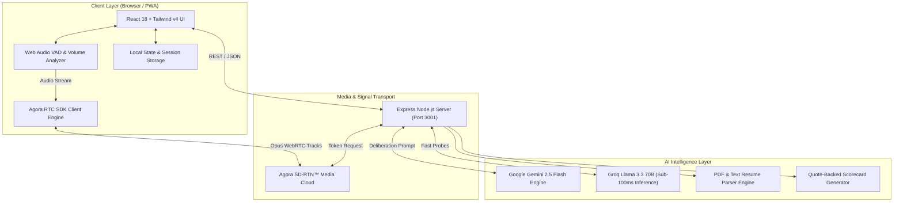
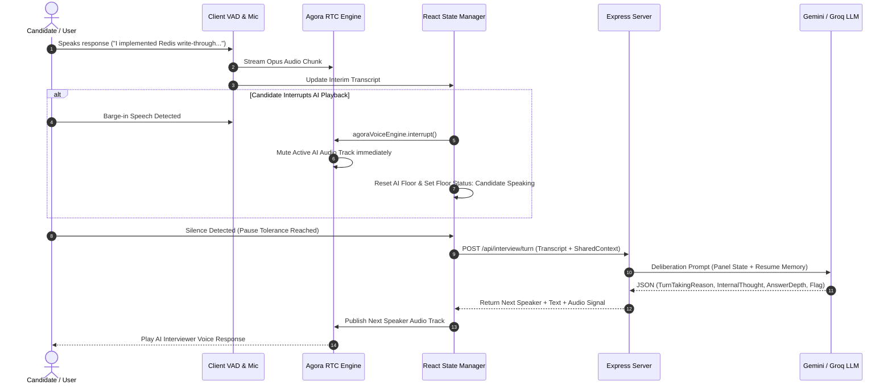
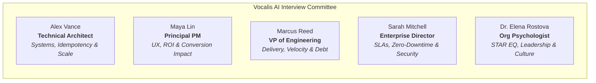

<div align="center">

  

  # 🎙️ Vocalis AI
  ### Enterprise Autonomous Multi-Role AI Voice Interview Platform

  **EchoSphere Hackathon 2026 Submission** | *Track: AI Interview Track (PS11)*  
  *Author: [Riyanshi Verma](https://github.com/RiyanshiVerma-11)*  

  [](https://github.com/RiyanshiVerma-11/Vocalis-AI)
  [](https://www.agora.io/)
  [](https://ai.google.dev/)
  [](https://groq.com/)
  [](https://reactjs.org/)
  [](https://www.typescriptlang.org/)
  [](https://tailwindcss.com/)
  [](https://web.dev/progressive-web-apps/)
  [](LICENSE)

  <br />

  *Real-time cross-functional AI committee deliberation, sub-100ms VAD barge-in voice transport, dynamic difficulty calibration, and quote-backed scorecard synthesis.*

  <br />

  [GitHub Repository](https://github.com/RiyanshiVerma-11/Vocalis-AI) · [Live Demo](http://localhost:3000) · [Architecture & Diagrams](#-system-architecture) · [PS11 Feature Matrix](#-ps11-hackathon-feature-matrix) · [API Specification](#-api-specifications) · [Quick Start](#-quick-start--installation)

</div>

---

## 📌 Table of Contents

- [Executive Summary](#-executive-summary)
- [PS11 Hackathon Feature Matrix](#-ps11-hackathon-feature-matrix)
- [System Architecture](#-system-architecture)
  - [High-Level Component Architecture](#high-level-component-architecture)
  - [Sub-100ms VAD Barge-In & Deliberation Sequence](#sub-100ms-vad-barge-in--deliberation-sequence)
  - [Dynamic Calibration State Machine](#dynamic-calibration-state-machine)
- [The AI Interview Committee](#-the-ai-interview-committee)
- [Key Core Capabilities](#-key-core-capabilities)
- [Workspace Modes](#-workspace-modes)
- [API Specifications](#-api-specifications)
- [Repository Structure](#-repository-structure)
- [Quick Start & Installation](#-quick-start--installation)
- [Environment Configuration](#-environment-configuration)
- [Verification & Testing](#-verification--testing)
- [License & Acknowledgments](#-license--acknowledgments)

---

## 💡 Executive Summary

**Vocalis AI** is a production-grade, autonomous multi-role AI voice interviewing platform built for modern hiring teams and candidates. Traditional AI interview tools deploy a single static persona that listens passively to one-off text prompts. In contrast, **Vocalis AI** deploys a dynamic panel of 5 specialized AI personas—**Lead Systems Architect**, **Principal Product Manager**, **VP of Engineering**, **Enterprise Client Director**, and **Lead Org Psychologist**.

Using **Agora WebRTC audio transport** with sub-100ms Voice Activity Detection (VAD) barge-in, Vocalis AI allows candidates to interrupt panelists naturally. After every response, the AI committee deliberates backstage via Gemini 2.5 / Groq Llama 3.3 to evaluate answer depth, detect vague buzzwords or resume contradictions, adjust interview difficulty dynamically (Foundational → Staff/Principal), and generate an **executive evaluation scorecard backed by verbatim transcript quote citations**.

---

## 🎯 PS11 Hackathon Feature Matrix

Vocalis AI implements all 11 core requirements specified in the **EchoSphere PS11 AI Interview Track**:

| PS11 Requirement | Vocalis AI Technical Implementation | UI Indicator | Status |
| :--- | :--- | :---: | :---: |
| **1. Mandatory Agora Voice SDK** | Integrated `agora-rtc-sdk-ng` WebRTC client + server-side `agora-token` builder (`/api/agora/token`). | `Radio` Badge (`Agora RTC / AI`) | ✅ **Fully Integrated** |
| **2. Real-Time & Interruptible Voice** | Sub-100ms barge-in VAD (`agoraVoiceEngine.interrupt()`). Candidate speech instantly halts active AI audio tracks. | Interruption Indicator | ✅ **Fully Integrated** |
| **3. Multiple Interviewer Roles** | 5 distinct panel personas (Technical Architect, PM, VP Engineering, Enterprise Customer, Psychologist). | Multi-Avatar Stage | ✅ **Fully Integrated** |
| **4. Shared Candidate Context** | Unified `SharedCandidateContext` bus tracking resume metrics, turn history, depth levels, and open probes. | Live Panel State Sidebar | ✅ **Fully Integrated** |
| **5. Dynamic Follow-Up Probes** | Gemini 2.5 Flash / Groq engine generates adaptive follow-ups based on candidate's technical depth. | Adaptive Strategy Badges | ✅ **Fully Integrated** |
| **6. Controlled Turn-Taking** | Panelists deliberate backstage in JSON format and justify turn-taking rationale before passing the floor. | Backstage Thought Feed | ✅ **Fully Integrated** |
| **7. Role-Play & Scenarios** | PS11 Demo Scenario (*The Missing Business Impact*) where Technical & PM interviewers challenge cross-functional trade-offs. | Scenario Selector | ✅ **Fully Integrated** |
| **8. Dynamic Difficulty Calibration** | Real-time calibration (Foundational → Staff/Principal) rendered on a live SVG trajectory sparkline. | `DifficultyChart.tsx` | ✅ **Fully Integrated** |
| **9. Contradiction & Vague Detection** | Real-time flag detector highlighting `contradiction`, `vague`, and `missing_impact` items live in the panel feed. | Live Alert Cards | ✅ **Fully Integrated** |
| **10. Evidence-Based Feedback** | Final assessment report with verbatim quote citations linked to exact timestamped transcript turns. | `FinalAssessmentModal` | ✅ **Fully Integrated** |
| **11. Clear AI Disclosure** | Persistent `AIDisclosureBanner` explicitly notifying candidate they are interacting with an AI panel. | Top Banner Notice | ✅ **Fully Integrated** |

---

## 🏗️ System Architecture

### High-Level Component Architecture



---

### Sub-100ms VAD Barge-In & Deliberation Sequence



---

### Dynamic Calibration State Machine

```mermaid
stateDiagram-v2
    [*] --> Foundational: Interview Started (Default Senior Target)

    state Foundational {
        [*] --> F_Evaluating
        F_Evaluating --> Intermediate: Surface Answer + High Confidence
        F_Evaluating --> Foundational: Vague / Needs Probing
    }

    state Intermediate {
        [*] --> I_Evaluating
        I_Evaluating --> Senior: Solid System Design + Keywords Matched
        I_Evaluating --> Foundational: Contradictions Detected
    }

    state Senior {
        [*] --> S_Evaluating
        S_Evaluating --> Staff_Principal: Deep Architectural Insights + Trade-offs
        S_Evaluating --> Intermediate: Missing Business Impact
    }

    state Staff_Principal {
        [*] --> P_Evaluating
        P_Evaluating --> Staff_Principal: Consistently Deep Insights
        P_Evaluating --> Senior: Incomplete Edge-Case Handling
    }

    Staff_Principal --> [*]: Finish & Evaluate
    Senior --> [*]: Finish & Evaluate
```

---

## 👥 The AI Interview Committee

Vocalis AI deploys a balanced, 5-persona cross-functional panel. Each persona maintains a distinct voice profile, focus area, and evaluation bias:



| Interviewer Persona | Role | Focus Area | Probing Strategy |
| :--- | :--- | :--- | :--- |
| **Alex Vance** | Technical Architect | Distributed Systems, Concurrency, Storage | Demands exact failure mechanics, idempotency keys, and partition recovery. |
| **Maya Lin** | Principal PM | User Workflows, Product Impact, ROI, Metrics | Challenges pure backend plumbing; asks how tech decisions impact conversion. |
| **Marcus Reed** | VP of Engineering | Team Velocity, Tech Debt, Leadership, Delivery | Evaluates pragmatic trade-offs, engineering deadlines, and team health. |
| **Sarah Mitchell** | Enterprise Customer | SLAs, Zero-Downtime, Compliance, Security | Protects enterprise trust; challenges breaking API changes and downtime. |
| **Dr. Elena Rostova** | Org Psychologist | STAR Framework, EQ, Conflict Resolution | Evaluates personal accountability vs team "we" claims and growth mindset. |

---

## 🚀 Key Core Capabilities

1. **🎙️ Sub-100ms VAD Barge-In & Voice Streaming:** Powered by Agora RTC Engine (`agora-rtc-sdk-ng`). Speech recognition automatically pauses when the candidate holds the floor (`Hold Floor` mode) and yields control smoothly.
2. **🧠 Backstage Committee Deliberation:** After every turn, the AI panel generates backstage thought logs detailing why a specific interviewer takes the floor, answer depth classification, and flagged concerns.
3. **📈 Live Difficulty Trajectory Sparkline:** SVG chart dynamically tracks candidate trajectory from **Foundational → Staff/Principal** across turns.
4. **⚠️ Real-Time Answer Quality Alerts:** Instant UI notifications for `Contradiction Detected`, `Vague Answer`, and `Missing Business Impact`.
5. **📄 Verbatim Quote-Citing Executive Scorecards:** Generates 360° hiring reports featuring overall hiring recommendations, radar competency breakdown, and transcript quote citations.
6. **🔒 Nodemailer SMTP OTP & Auth Sessions:** Demo authentication with instant 1-click test login presets for Candidates (`candidate@vocalis.ai`) and Hiring Teams (`recruiter@vocalis.ai`).

---

## 💻 Workspace Modes

Vocalis AI features two tailored workspace environments:

### 1. Candidate Practice View
Designed for job seekers to practice technical and behavioral screens under realistic panel pressure. Features microphone controls, pause tolerance adjustments, quick scenario prompts, and focus mode.

### 2. Recruiter & Hiring Team View
Designed for talent acquisition leaders to parse resumes, build custom panel committees, launch live candidate screenings, review evaluated candidate pipelines, and export quote-backed scorecards.

---

## 📡 API Specifications

### 1. Generate Agora WebRTC Token
```http
POST /api/agora/token
Content-Type: application/json

{
  "channelName": "vocalis-session-101",
  "uid": 12345
}
```
**Response:**
```json
{
  "token": "007eJxTYJg...",
  "channel": "vocalis-session-101",
  "uid": 12345
}
```

---

### 2. Process Committee Interview Turn
```http
POST /api/interview/turn
Content-Type: application/json

{
  "transcript": [
    { "speakerName": "Alex Vance", "speakerRole": "technical", "content": "Tell us about your payments mesh." }
  ],
  "sharedContext": { "currentDifficulty": "Senior", "candidateName": "Jordan Reed" },
  "userResponse": "I used Redis write-through cache with Pub/Sub invalidation."
}
```
**Response:**
```json
{
  "nextSpeaker": { "id": "maya", "name": "Maya Lin", "role": "product" },
  "turnTakingReason": "Technical answer complete; probing business ROI and customer conversion impact.",
  "internalThought": "Candidate gave strong Redis architecture details. Need PM input on checkout SLA impact.",
  "answerDepth": "Deep",
  "responseText": "That architecture handles scale—how did cache invalidation impact checkout conversion during peak load?",
  "detectedFlags": []
}
```

---

### 3. Generate Final Assessment Scorecard
```http
POST /api/interview/assess
Content-Type: application/json

{
  "transcript": [...],
  "candidateName": "Jordan Reed",
  "targetRole": "Senior Systems Architect"
}
```
**Response:**
```json
{
  "recommendation": "Strong Hire",
  "overallScore": 88,
  "competencies": {
    "technicalArchitecture": 90,
    "businessImpact": 82,
    "communication": 88,
    "leadership": 85,
    "problemSolving": 92
  },
  "quoteCitations": [
    { "turn": 2, "quote": "We enforced write-through caching with Redis Pub/Sub invalidation.", "verdict": "Demonstrated deep distributed cache mechanics." }
  ]
}
```

---

## 📁 Repository Structure

```
37 VoiceIntro AI/
├── index.html                    # HTML5 Entry point & PWA meta tags
├── package.json                  # Dependencies & scripts
├── vite.config.ts                # Vite bundler configuration
├── server.ts                     # Express Backend Server (Agora & LLM APIs)
├── public/                       # Static assets & PWA webmanifest
│   ├── icon-192.png
│   ├── icon-512.png
│   └── site.webmanifest
└── src/
    ├── App.tsx                   # Main Routing, Workspace Mode & Global State
    ├── index.css                 # Tailwind CSS v4 design system
    ├── main.tsx                  # React DOM mount point & PWA registration
    ├── components/
    │   ├── InterviewerStage.tsx  # Panel stage & active speaker cards
    │   ├── TranscriptView.tsx    # Live synchronized transcript & backstage thoughts
    │   ├── VoiceController.tsx   # Agora WebRTC mic controls & VAD visualizer
    │   ├── RecruiterDashboard.tsx# Hiring team candidate pipeline & panel builder
    │   ├── LandingPage.tsx       # Marketing landing page & hero section
    │   ├── LoginPage.tsx         # Side-by-side Auth & 1-click Demo logins
    │   ├── StudioSidebar.tsx     # Sticky navigation sidebar & user profile
    │   ├── ResumeDrawer.tsx      # Candidate resume parser & question memory
    │   └── FinalAssessmentModal.tsx # Quote-backed executive evaluation report
    ├── data/                     # Scenarios, interviewers & mock resumes
    ├── types/                    # TypeScript interfaces & domain schemas
    └── utils/                    # Agora RTC engine & avatar helper utilities
```

---

## ⚡ Quick Start & Installation

### Prerequisites
- **Node.js**: v18.0.0 or higher
- **npm** or **bun**

### 1. Clone & Install
```bash
git clone https://github.com/RiyanshiVerma-11/Vocalis-AI.git
cd Vocalis-AI
npm install
```

### 2. Configure Environment Variables
Create a `.env` file in the project root:

```env
# Gemini API Key (Required for LLM Deliberation Engine)
GEMINI_API_KEY="your_gemini_api_key_here"

# Groq API Key (Optional — Ultra-Fast Sub-100ms LLM Inference)
GROQ_API_KEY="your_groq_api_key_here"

# Application URL
APP_URL="http://localhost:3000"

# Agora Credentials (Get from console.agora.io)
VITE_AGORA_APP_ID="your_agora_app_id_here"
AGORA_APP_ID="your_agora_app_id_here"
AGORA_APP_CERTIFICATE="your_agora_app_certificate_here"

# ── AGORA DEV MODE SWITCH ──────────────────────────────────────────────────
# "false" = Browser Speech API (0 Agora minutes consumed — ideal for development)
# "true"  = Real Agora WebRTC Media Channel (enable for official demo recording)
VITE_AGORA_ENABLED="false"
```

### 3. Run Development Server
```bash
npm run dev
```
Open **`http://localhost:3000`** in your browser.

---

### 🐋 Docker 1-Command Production Deployment

Deploy the complete platform inside a multi-stage production container with zero dependencies required:

```bash
# 1. Build and launch with Docker Compose
docker compose up --build -d

# 2. View container logs
docker compose logs -f

# 3. Stop application container
docker compose down
```

The containerized application will be live at **`http://localhost:3000`**!

---

## 🛡️ Environment Configuration

| Variable | Description | Required | Default |
| :--- | :--- | :---: | :---: |
| `GEMINI_API_KEY` | Google Gemini 2.5 Flash API Key for panel deliberation. | **Yes** | — |
| `GROQ_API_KEY` | Groq Llama 3.3 API key for ultra-fast turn responses. | Optional | — |
| `VITE_AGORA_APP_ID` | Agora App ID for client WebRTC RTC engine. | **Yes** | — |
| `AGORA_APP_CERTIFICATE` | Agora Certificate for server-side token builder. | **Yes** | — |
| `VITE_AGORA_ENABLED` | Toggle real Agora WebRTC channel vs dev Web Speech API. | No | `false` |

---

## 🧪 Verification & Testing

Verify system compilation, type correctness, and linting rules:

```bash
# Type check and linting
npm run lint

# Build production bundle
npm run build
```

---

## 📄 License & Acknowledgments

- Built for **EchoSphere Hackathon 2026** (*AI Interview Track - PS11*).
- Powered by **Agora Real-Time Engagement Platform**, **Google Gemini 2.5 Flash**, and **Groq Llama 3.3 70B**.
- Released under the [MIT License](LICENSE).

<div align="center">
  <sub>Created with ❤️ by <strong><a href="https://github.com/RiyanshiVerma-11">Riyanshi Verma (@RiyanshiVerma-11)</a></strong> for EchoSphere 2026</sub>
</div>
